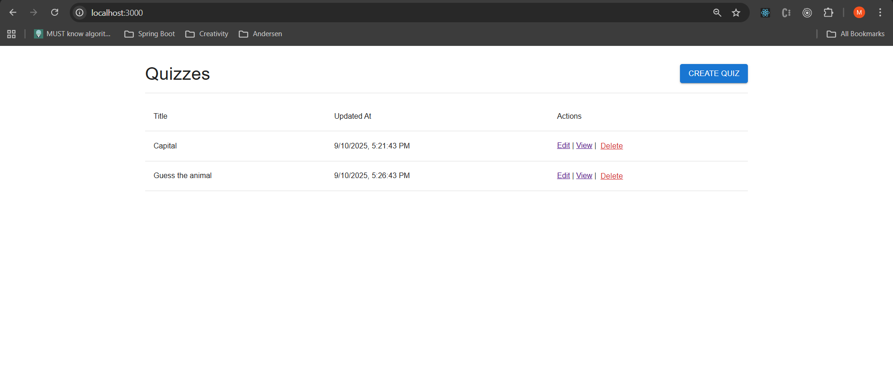
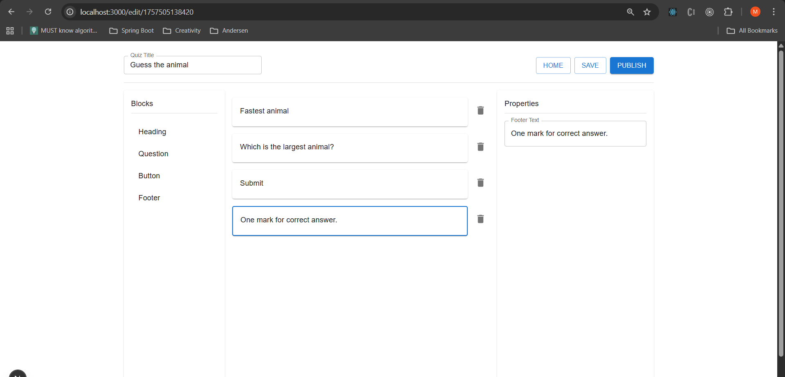
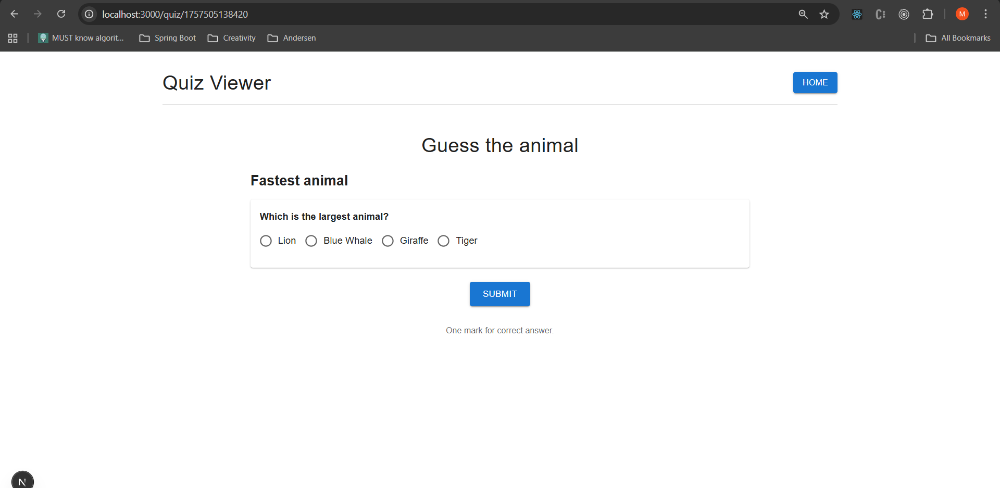

# Quiz Builder App

A full-featured quiz builder and viewer built with **Next.js**, **Nest.js**, **Material UI**, and **@dnd-kit** for drag-and-drop.  
The project allows you to create, edit, reorder, and publish quizzes — all stored in Postgresql.

Live Demo: [Quiz Builder on Vercel](https://quiz-builder-frontend-liard.vercel.app/)

---

## App Screenshots

- Quiz list
  
- Quiz editor
  
- Quiz viewer
  

---

## Features

### Quiz Builder

- Add different block types:
  - Heading
  - Question (single or multiple choice)
  - Button
  - Footer
- Drag-and-drop to reorder blocks using **@dnd-kit**.
- Delete blocks or edit their properties (text, options, multiple-choice toggle).
- Save and publish quizzes.

### Quiz Viewer

- View published quizzes with a responsive layout.
- Interactive radio buttons or checkboxes for questions.
- Free-text input option if no answers are provided.
- Styled buttons and footers for user interaction.

### Data Management

- Quizzes are stored in **localStorage** (browser persistence).
- Uses **axios-mock-adapter** to simulate backend API endpoints.
- Full CRUD support (create, read, update, delete) for quizzes without a real backend.

### Tech Stack

- **Next.js** – React framework with file-based routing
- **Material UI (MUI)** – UI components and styling
- **@dnd-kit** – drag-and-drop support
- **Axios + axios-mock-adapter** – API layer and mocking
- **localStorage** – lightweight data persistence
- **TypeScript** – type safety

---

## Known Issues

- **Drag & Drop for Quiz Blocks**

Currently, the application does not support drag-and-drop functionality for adding quiz blocks. Blocks can only be added by clicking on the block name.  
Planned improvements include implementing drag-and-drop for adding blocks.

---

## Why These Choices

- **Next.js**: Built-in routing and seamless deployment with Vercel.
- **Material UI**: Clean, modern UI with ready-to-use components.
- **@dnd-kit**: Actively maintained drag-and-drop library compatible with React 19.
- **Axios + Mock Adapter**: Simulates real API calls while storing data locally.
- **localStorage**: Provides persistence without requiring a backend.
- **Vercel**: Optimized deployment and preview environments.

---
